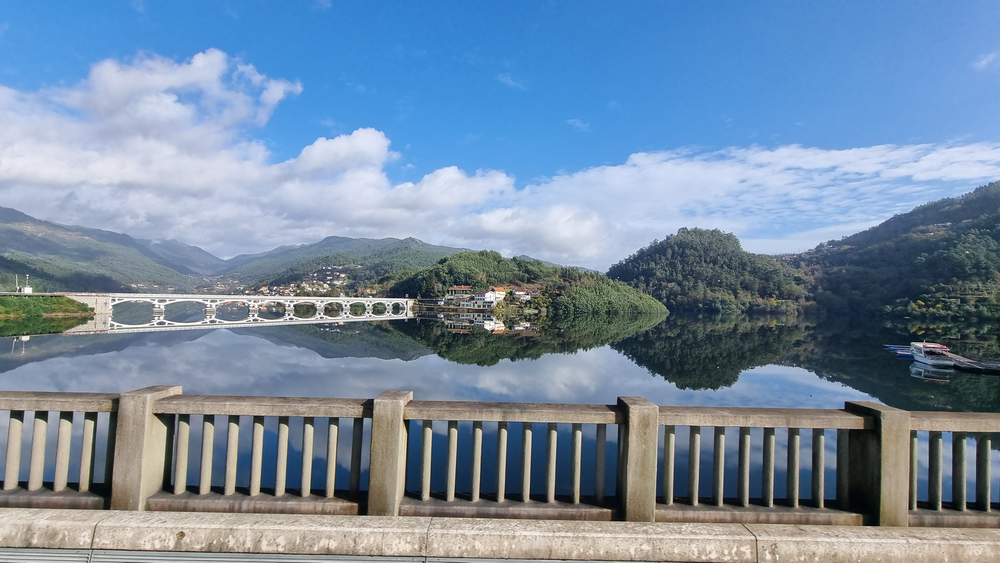
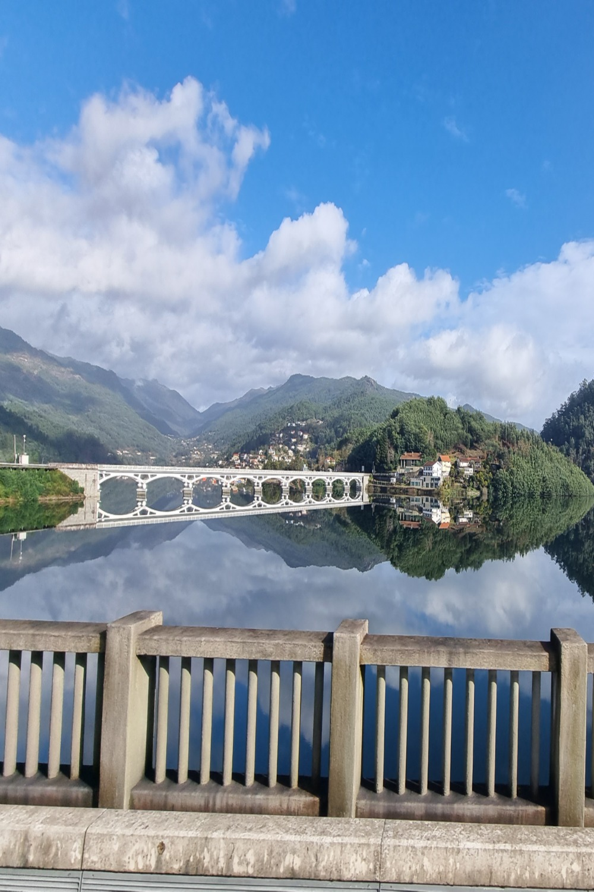
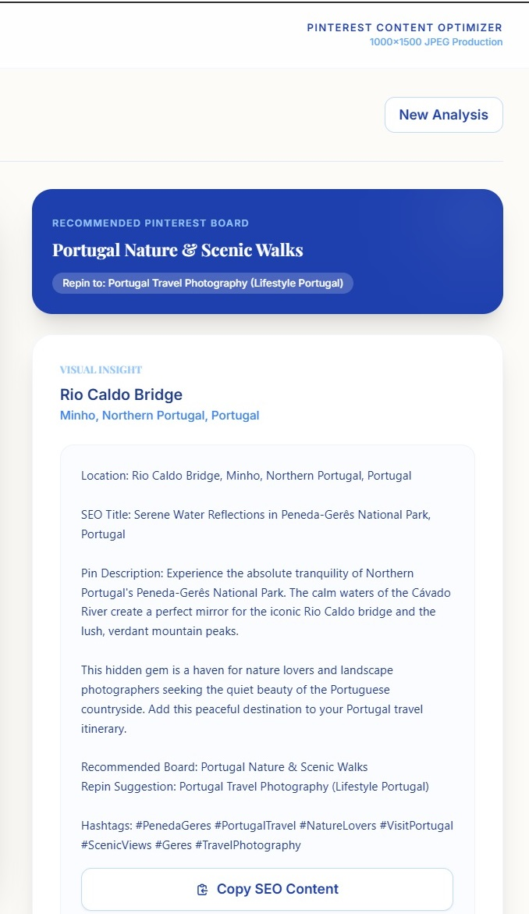
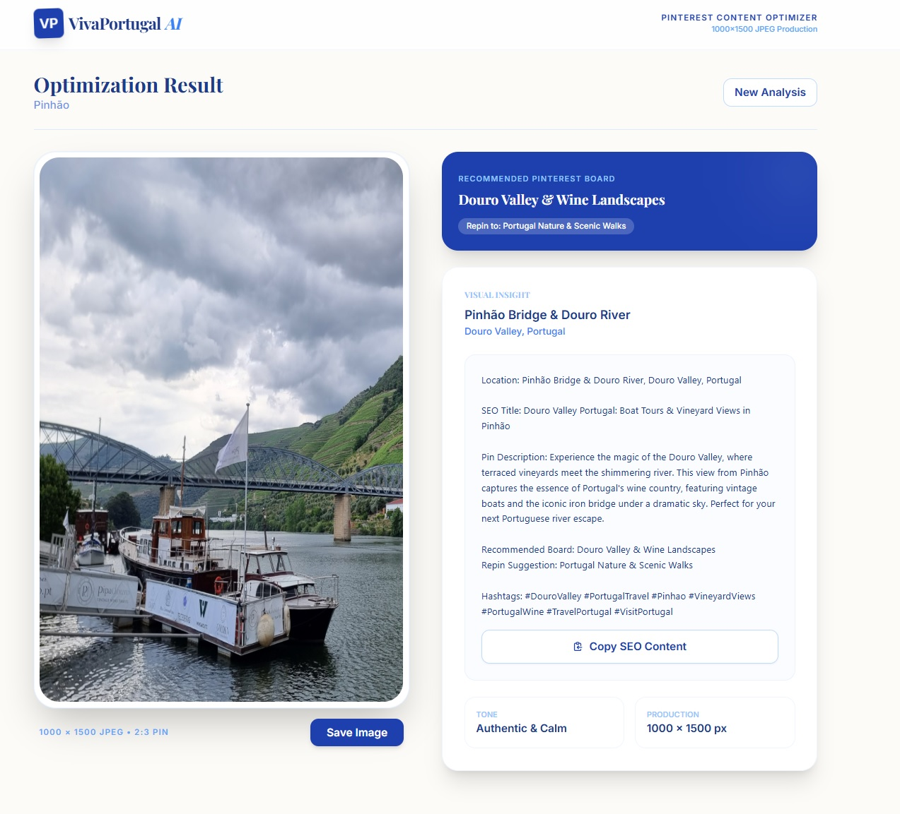

Pinterest-Pin-creator

AI-powered system that transforms real photos into Pinterest-ready pins —
automatically optimized for format, SEO, and board placement.

From photo upload to SEO-ready pin in a single automated flow.

Why it matters

Pinterest rewards consistent, high-quality vertical content, but creating and optimizing pins manually is slow, repetitive, and hard to scale.

Creators and brands typically struggle with three core problems:

⏱️ Time — turning photos into Pinterest-ready pins takes minutes per image

📉 SEO uncertainty — weak titles, descriptions, or wrong boards limit reach

🔁 Lack of scalability — manual workflows don’t support daily publishing

Pinterest-Pin-creator automates the entire process:

raw image → optimized pin → SEO metadata → correct board placement

The outcome

Faster content production

Consistent visual quality

Higher chances of saves, impressions, and long-term organic reach

This tool is built for sustainable Pinterest growth, not short-term tricks or paid ads.

Developed and tested on real travel photography from Portugal in live Pinterest experiments.

What it does

The system automatically:

Crops images to the Pinterest-recommended 2:3 ratio (1000×1500)

Preserves key visual elements (landmarks, horizon, subject)

Detects location (city / region / country)

Generates SEO-optimized metadata:

Pin titles

Descriptions

Hashtags

Recommends the most relevant Pinterest board and section

No manual editing. No Photoshop. No guessing.

Use cases

Designed for professionals who rely on Pinterest as a long-term traffic channel:

Pinterest marketing specialists

Travel & lifestyle brands

Etsy & e-commerce sellers

Content creators & photographers

Especially useful for creators who publish daily or weekly and need consistent quality at scale.

Example workflow (Travel Photography)

Upload a real photo

AI analyzes composition and location

Output:

Pinterest-ready JPEG pin

SEO title and description

Relevant hashtags

Board recommendation

📸 Visual example
Real photo → Pinterest-ready pin
1️⃣  (

2️⃣ Pinterest-optimized crop (2:3) 

3️⃣ SEO metadata & board recommendation 

4️⃣ Full UI overview 

Extended workflow
Product → Mockup → Pinterest Pin

In addition to travel photography, the system also supports
AI-powered product content creation.

This extended workflow combines product mockup generation with
Pinterest optimization into a single automated pipeline.

Workflow steps

Product image is uploaded

Background is automatically removed

Realistic lifestyle mockups are generated

The best-performing mockup is selected

Pinterest-Pin-creator processes the image:

Crops to the Pinterest-recommended 2:3 ratio

Generates SEO-optimized title and description

Suggests relevant hashtags

Recommends the best Pinterest board and section

📸 Visual example
Product → Mockup → Pinterest-ready pin
1️⃣ Product image input

2️⃣ AI-generated lifestyle mockups

Background is automatically removed and multiple realistic lifestyle mockups are generated.

3️⃣ Pinterest-ready pin with SEO & board recommendation

The selected mockup is converted into a Pinterest-optimized pin with full SEO metadata.

Technology overview

Google AI Studio (Vision + Text models)

Prompt engineering & decision logic

Pinterest SEO best practices

No-code / low-code architecture

Results

Faster Pinterest content production

Consistent, platform-optimized visuals

SEO-ready pins without manual editing

Scalable workflow for batch processing

Live context

This project is actively used for:

VivaPortugal brand

Pinterest organic traffic experiments

AI-powered content automation workflows

Notes

This repository demonstrates logic and workflow only.
No production code is included.

Built by Mikhail Gonnochenko
